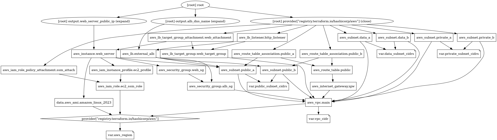
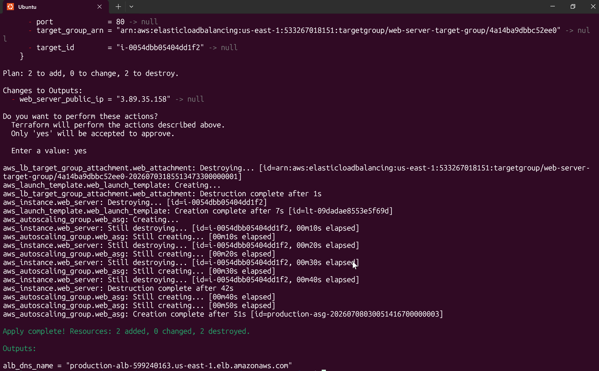

# AWS High-Availability Infrastructure with Terraform

## 📌 Project Overview
This project demonstrates the deployment of a highly available, secure web workload within a custom AWS VPC. The architecture evolved from a single-instance proof of concept into an automated, multi-AZ **Auto Scaling Group (ASG)** managed completely via **Terraform (Infrastructure as Code)**. 

An Application Load Balancer (ALB) safely routes public traffic to Apache web servers housed across multiple Availability Zones (`us-east-1a` and `us-east-1b`). Administrative access is managed securely without public exposure via AWS Systems Manager (SSM).

---

## 🛠️ Architecture Evolution

### Phase 1: Single-Instance Proof of Concept (PoC)
* Provisioned baseline VPC networking (subnets, route tables, internet gateway).
* Deployed a single EC2 instance using a custom user-data script to verify web server initialization behind an Application Load Balancer.

### Phase 2: IaC Refactoring for Multi-AZ High Availability
* **Infrastructure as Code:** Fully automated infrastructure provisioning using modularized Terraform files (`vpc.tf`, `compute.tf`, `providers.tf`, `variables.tf`, `outputs.tf`).
* **Launch Templates & Auto Scaling:** Replaced the static EC2 instance with a flexible Launch Template and an Auto Scaling Group (ASG) maintaining dynamic capacity.
* **Multi-AZ Resilience:** Configured the ASG to distribute instances across public subnets in multiple Availability Zones (`us-east-1a` and `us-east-1b`) to eliminate single points of failure.
* **Automated Health Checks:** Integrated the ASG with the ALB to handle dynamic target group registration and continuous 10-second health check monitoring.

---

## 💡 Business Case & Architecture Goals
In a production environment, exposing application servers directly to the public internet introduces severe security vulnerabilities, while unmanaged single-point-of-failure setups risk costly business downtime.

This architecture was explicitly engineered to simulate a real-world corporate migration strategy designed to solve three critical business challenges:

### 1. Eliminating the Public Attack Surface (Security)
* **The Problem:** Placing servers directly on the public internet exposes them to continuous automated brute-force attacks, vulnerability scanning, and potential data breaches.
* **The Solution:** By placing application servers behind an Application Load Balancer and restricting Security Groups to accept traffic *only* from the ALB, the servers are shielded from direct public exposure.

### 2. Safeguarding High Availability (Business Continuity)
* **The Problem:** If a standalone web server crashes or undergoes maintenance, the business loses revenue and customer trust immediately during the outage.
* **The Solution:** Introducing an Application Load Balancer combined with a Multi-AZ Auto Scaling Group establishes true high availability. By constantly monitoring backend node health at 10-second intervals, the system automatically replaces failing nodes and reroutes traffic to healthy resources instantly.

### 3. Balancing Security with Strict Fiscal Responsibility (Cost Optimization)
* **The Problem:** Standard enterprise blueprints dictate using NAT Gateways to allow isolated servers to talk to the internet for administrative tasks. However, AWS charges a baseline of ~$32.40/month per NAT Gateway idle—an unjustifiable expense for an early proof-of-concept (PoC) or small-scale application.
* **The Solution:** This project implements an advanced design pivot. By leveraging AWS Systems Manager (SSM), secure administrative terminal access is maintained directly over the internal AWS backbone, completely eliminating the need for expensive NAT Gateway infrastructure.

---

## 📸 Deployment Receipts & Verification

| Architecture Graph | Multi-AZ Terraform Apply | Target Group Health Checks |
| :---: | :---: | :---: |
|  |  |  |

---

## 🛠️ Technical Skills Demonstrated
* **Infrastructure as Code (IaC):** Modularized Terraform architecture, state handling, declarative resource dependencies, and parameterization via variables.
* **Networking:** Custom VPC design with multi-AZ public subnet isolation, Internet Gateways, custom Route Tables, and NACLs.
* **High Availability & Compute:** AWS Launch Templates, Auto Scaling Groups (ASG), and Application Load Balancers (ALB) with health check thresholds.
* **Systems Administration:** Automated Linux bootstrapping (User Data), AWS Systems Manager (SSM) fleet control, and HTTP status code troubleshooting.

---

## 📊 Quantifying Business Impact & Architecture Metrics
* **Zero-Trust Security Enforcement:** Implemented strict multi-tier security groups, restricting 100% of public HTTP ingress directly to the ALB. This reduced the application servers' direct network attack surface to zero public exposure.
* **High-Availability RTO Optimization:** Configured an ALB and Multi-AZ ASG with optimized health check thresholds (10-second intervals), minimizing potential application downtime by ensuring automated traffic rerouting within 20 seconds of a backend node failure.
* **Cost-Optimized VPC Engineering:** Designed a cost-effective VPC architecture. Intentionally routed administrative traffic securely via AWS Systems Manager (SSM) to completely bypass traditional NAT Gateway architectures, eliminating over $30/month in idle infrastructure charges.

---

## 🔍 Real-World Troubleshooting Chronicles

### Incident 1: CIDR Block Optimization & Subnet Allocation Conflict
* **The Issue:** During the initial network provisioning phase, the planned IP addressing scheme for the custom VPC hit an allocation conflict. The initial subnet CIDR blocks overlapped, preventing AWS from creating the isolated subnet tiers.
* **The Resolution:** Analyzed the VPC design and adjusted the CIDR prefix allocations to properly segment the `10.0.0.0` network without overlap. 

### Incident 2: The Target Group 403 Forbidden Alignment
* **The Issue:** Once network routing was established, the ALB Target Group continuously marked instances as `Unhealthy`, preventing traffic from reaching the application even though Apache was active.
* **The Discovery & Fix:** Used SSM to access the command line and ran a local loopback test (`curl -I http://localhost:80`), which returned a `403 Forbidden` status because `/var/www/html/` was empty. Added an `index.html` landing page via User Data scripts, after which the Target Group immediately refreshed to a green `Healthy` status.

### Incident 3: Terraform Refactoring to Multi-AZ ASG
* **The Issue:** Transitioning from a static `aws_instance` to an `aws_autoscaling_group` required destroying the static EC2 resource while seamlessly attaching the new ASG instances to the existing ALB Target Group without causing conflicting resource locks.
* **The Resolution:** Modularized the configuration into `vpc.tf` and `compute.tf`, defining an `aws_launch_template` with target group attachment hooks. Verified clean lifecycle management using `terraform plan` before performing a seamless `terraform apply`.
