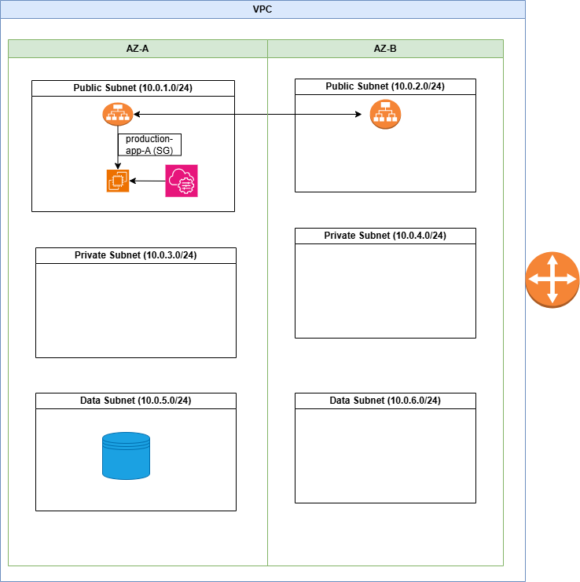
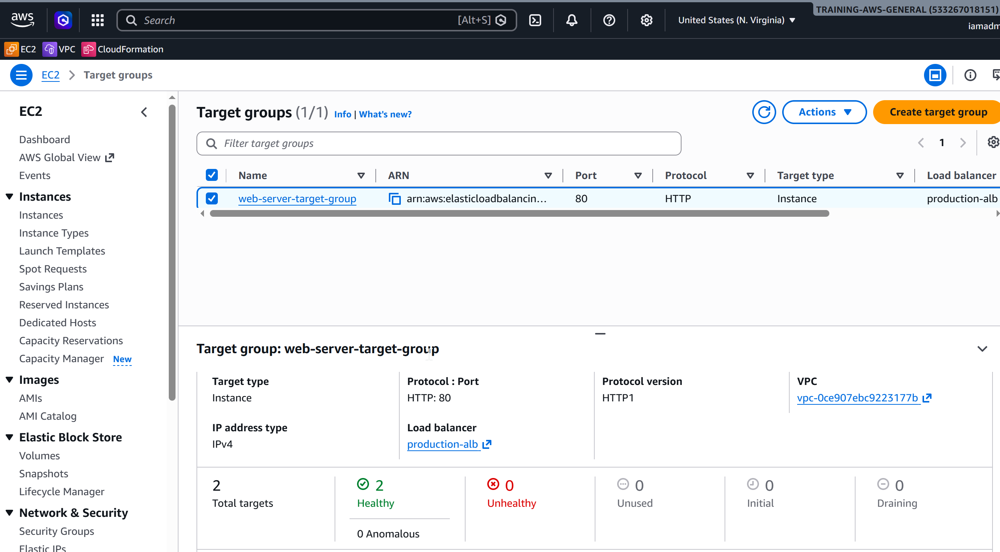
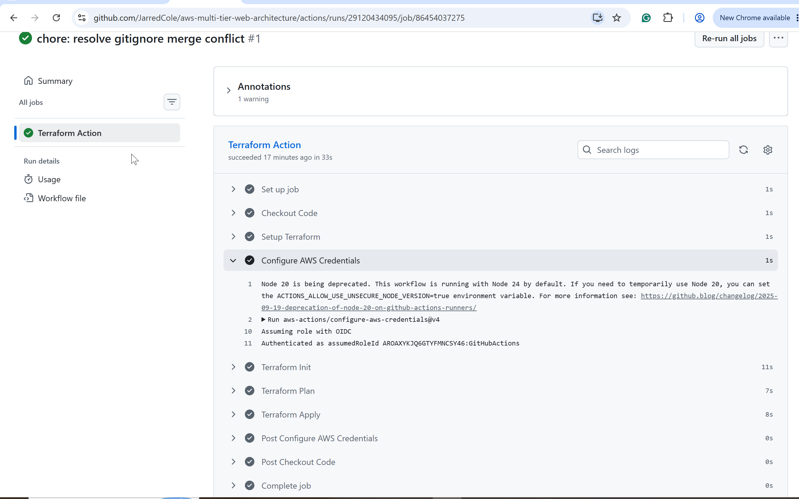
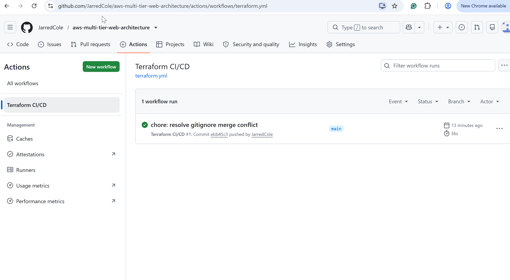
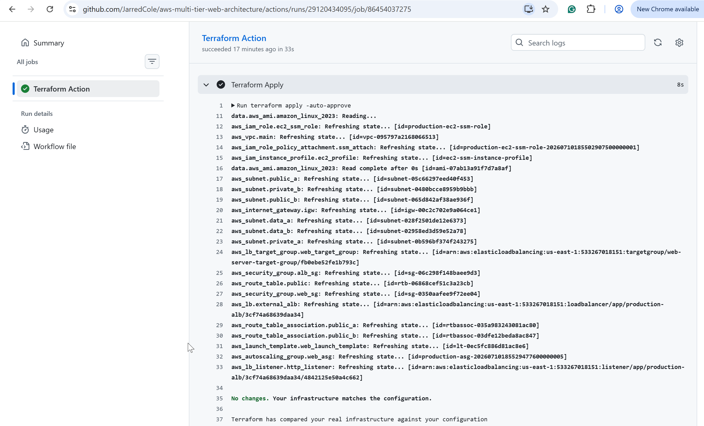
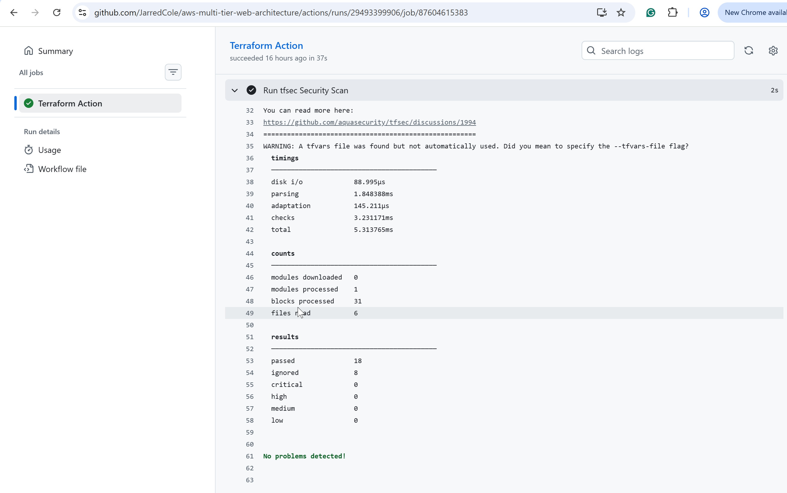
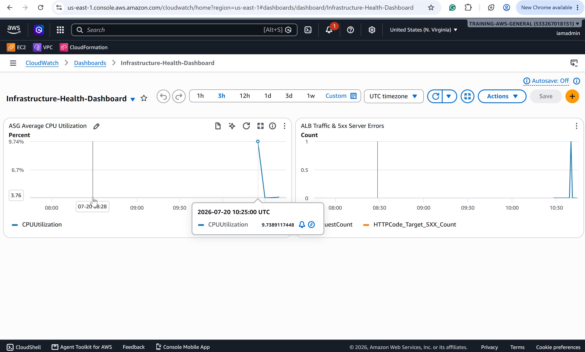

# AWS High-Availability Infrastructure with Terraform 

## 📌 Project Overview
This project demonstrates the deployment of a highly available, secure web workload within a custom AWS VPC. The architecture evolved from a single-instance proof of concept into a fully automated, multi-AZ **Auto Scaling Group (ASG)** and isolated **Data Tier** managed completely via **Terraform (Infrastructure as Code)**. 

To achieve production-grade maturity, manual operations have been entirely replaced by a GitOps workflow. The infrastructure is continuously deployed and synchronized via an automated **GitHub Actions CI/CD pipeline** leveraging secure, tokenless OpenID Connect (OIDC) authentication.

An Application Load Balancer (ALB) safely routes public traffic to Apache web servers housed across multiple Availability Zones (`us-east-1a` and `us-east-1b`). Administrative access is managed securely without public exposure via AWS Systems Manager (SSM).

---

## 🛠️ Architecture Evolution

### Phase 1: Single-Instance Proof of Concept (PoC)
* Provisioned baseline VPC networking (subnets, route tables, internet gateway).
* Deployed a single EC2 instance using a custom user-data script to verify web server initialization behind an Application Load Balancer.

### Phase 2: IaC Refactoring for Multi-AZ High Availability
* **Infrastructure as Code:** Fully automated infrastructure provisioning using modularized Terraform files (`vpc.tf`, `compute.tf`, `providers.tf`, `variables.tf`, `outputs.tf`).
* **Launch Templates & Auto Scaling:** Replaced the static EC2 instance with a flexible Launch Template and an Auto Scaling Group (ASG) maintaining dynamic capacity.
* **Multi-AZ Resilience & Data Segmentation:** Configured the ASG to distribute instances across public subnets in multiple Availability Zones while establishing completely isolated Data subnets (`10.0.5.0/24` and `10.0.6.0/24`) to safely house future database tiers away from internet routing.
* **Automated Health Checks:** Integrated the ASG with the ALB to handle dynamic target group registration and continuous 10-second health check monitoring.

### Phase 3: Continuous Integration & Continuous Deployment (CI/CD)
* **GitOps Automation:** Designed a GitHub Actions workflow that automatically runs `terraform init`, `terraform plan`, and `terraform apply` upon every code push to the `main` branch.
* **Zero-Secret OIDC Authentication:** Configured an AWS IAM OpenID Connect (OIDC) Identity Provider to establish trust with GitHub. This allows the runner to assume short-lived IAM roles dynamically, completely removing the security risk of storing long-lived AWS Secret Access Keys in GitHub repositories.
* **Remote State Synchronization:** Connected the CI/CD runner to an S3 remote backend with DynamoDB state locking to safely manage state concurrency.

### Phase 4: DevSecOps Integration & Policy-as-Code Hardening
* **Automated Static Security Analysis (SCA):** Integrated `tfsec` and `TFLint` directly into the GitHub Actions pipeline, enforcing policy-as-code checks on every pull request and push to `main` before `terraform plan` executes.
* **Metadata Service Hardening (IMDSv2):** Configured the EC2 Launch Template to mandate Instance Metadata Service Version 2 (IMDSv2) token requirements, mitigating potential Server-Side Request Forgery (SSRF) and credential-theft vectors.
* **Protocol & Boundary Hardening:** Configured the Application Load Balancer to drop invalid HTTP headers automatically. Mitigated 10 identified security vulnerabilities (ranging from High to Critical) through explicit security group scoping, HTTP/HTTPS redirect patterns, and documented policy-as-code ignore directives for public-facing assets.

### Phase 5: Observability & Automated Alerting
- **Infrastructure Health Dashboards:** Provisioned custom CloudWatch Dashboards in Terraform (`monitoring.tf`) tracking ASG CPU utilization, ALB request volume, and HTTP 5xx error rates.
- **Proactive Incident Alerting:** Automated CloudWatch Metric Alarms linked to AWS Simple Notification Service (SNS) to deliver immediate email alerts for high resource utilization or upstream web server degradation.
- **Infrastructure-as-Code Observability:** Ensured all monitoring assets, metrics, and alerting thresholds are fully version-controlled and deployed via automated CI/CD pipelines.

---

## 💡 Business Case & Architecture Goals
In a production environment, exposing application servers directly to the public internet introduces severe security vulnerabilities, while unmanaged single-point-of-failure setups risk costly business downtime.

This architecture was explicitly engineered to simulate a real-world corporate migration strategy designed to solve three critical business challenges:

### 1. Eliminating the Public Attack Surface (Security)
* **The Problem:** Placing servers directly on the public internet exposes them to continuous automated brute-force attacks, vulnerability scanning, and potential data breaches.
* **The Solution:** By placing application servers behind an Application Load Balancer and restricting Security Groups to accept traffic *only* from the ALB, the servers are shielded from direct public exposure. The data tier is further isolated into subnets with zero internet gateways attached.

### 2. Safeguarding High Availability (Business Continuity)
* **The Problem:** If a standalone web server crashes or undergoes maintenance, the business loses revenue and customer trust immediately during the outage.
* **The Solution:** Introducing an Application Load Balancer combined with a Multi-AZ Auto Scaling Group establishes true high availability. By constantly monitoring backend node health at 10-second intervals, the system automatically replaces failing nodes and reroutes traffic to healthy resources instantly.

### 3. Balancing Security with Strict Fiscal Responsibility (Cost Optimization)
* **The Problem:** Standard enterprise blueprints dictate using NAT Gateways to allow isolated servers to talk to the internet for administrative tasks. However, AWS charges a baseline of ~$32.40/month per NAT Gateway idle—an unjustifiable expense for an early proof-of-concept (PoC) or small-scale application.
* **The Solution:** This project implements an advanced design pivot. By leveraging AWS Systems Manager (SSM), secure administrative terminal access is maintained directly over the internal AWS backbone, completely eliminating the need for expensive NAT Gateway infrastructure.

---

## 🛡️ DevSecOps, Static Security & Policy-as-Code

In enterprise environments, infrastructure deployment pipelines must enforce strict security governance automatically without relying on manual peer review alone. To shift security left, automated static code analysis is embedded directly into the CI/CD pipeline.

### **Security Hardening Highlights:**
* **IMDSv2 Mandatory Enforcement:** Explicitly enabled `http_tokens = "required"` within the launch template metadata options. This forces all internal metadata calls to require session tokens, neutralizing SSRF vulnerabilities.
* **ALB Header Injection Defense:** Enabled `drop_invalid_header_fields = true` on the external Application Load Balancer to drop non-standard or malformed HTTP headers before they reach backend application targets.
* **Policy-as-Code Governance (`tfsec`):** Scanned the entire codebase, resolving or explicitly documenting architectural trade-offs:
  * **Remediated Vulnerabilities:** Fixed missing token requirements, unhardened ALB headers, and missing VPC flow log retention strategy options.
  * **Documented Architectural Intent:** Applied inline `#tfsec:ignore` annotations specifically to public-facing resources (such as public subnets and public-facing ALBs) to maintain clean automated builds while explicitly documenting intentional public routing decisions.

---

## 📸 Deployment Receipts & Verification

### Phase 1 & 2: Infrastructure Layout & AWS State
| Architecture Diagram | Multi-AZ Terraform Apply | Target Group Health Checks |
| :---: | :---: | :---: |
|  |  |  |

### Phase 3: GitHub Actions CI/CD Pipeline Automation
| Secure OIDC AWS Auth | Pipeline Execution Success | State Synchronization (No Changes) |
| :---: | :---: | :---: |
|  |  |  |

### Phase 4: DevSecOps Integration & Policy-as-Code Hardening
| tfsec Security Scan |
| :---: |
|  |

### Phase 5: Observability & Automated Alerting
| Custom CloudWatch Widget |
| :---: |
|  |

### 🚀 Next Milestone: Containerization & Microservices
- [ ] Containerize the application using Docker and multi-stage builds.
- [ ] Set up AWS ECR (Elastic Container Registry) for container image lifecycle management.
- [ ] Migrate compute workloads to AWS ECS (Elastic Container Service) / Fargate.

---

## 🛠️ Technical Skills Demonstrated
* **Infrastructure as Code (IaC):** Modularized Terraform architecture, state handling, remote S3 backends, declarative resource dependencies, and parameterization via variables.
* **Automation & DevOps:** GitHub Actions pipeline configuration, CI/CD runner execution, and automated branch deployment strategies.
* **Cloud Security:** Tokenless authentication using OpenID Connect (OIDC), strict multi-tier security group clustering (Least Privilege), IAM roles, and private subnet isolation.
* **Networking:** Custom VPC design with multi-AZ public, private, and database subnet isolation, Internet Gateways, and custom Route Tables.
* **High Availability & Compute:** AWS Launch Templates, Auto Scaling Groups (ASG), and Application Load Balancers (ALB) with health check thresholds.
* **Systems Administration:** Automated Linux bootstrapping (User Data), AWS Systems Manager (SSM) fleet control, and HTTP status code troubleshooting.
* **DevSecOps & Static Analysis:** Automated
Infrastructure-as-Code scanning (tfsec, tflint), policy-as-code governance, IMDSv2 token enforcement, and vulnerability remediation.

---

## 📊 Quantifying Business Impact & Architecture Metrics
* **Zero-Trust Security Enforcement:** Implemented strict multi-tier security groups, restricting 100% of public HTTP ingress directly to the ALB. This reduced the application servers' direct network attack surface to zero public exposure.
* **High-Availability RTO Optimization:** Configured an ALB and Multi-AZ ASG with optimized health check thresholds (10-second intervals), minimizing potential application downtime by ensuring automated traffic rerouting within 20 seconds of a backend node failure.
* **Cost-Optimized VPC Engineering:** Designed a cost-effective VPC architecture. Intentionally routed administrative traffic securely via AWS Systems Manager (SSM) to completely bypass traditional NAT Gateway architectures, eliminating over $30/month in idle infrastructure charges.
* **Automated Deployment Velocity:** Replaced manual console configurations with an automated 36-second GitOps pipeline, reducing human deployment error vectors to zero.
* **Shift-Left Vulnerability Remediation:** Successfully identified, remediated, or governed 10 potential security risks (ranging from Medium to Critical) prior to deployment, eliminating misconfiguration risks before touching live AWS infrastructure.

---

## 🔍 Real-World Troubleshooting Chronicles

### Incident 1: CIDR Block Optimization & Subnet Allocation Conflict
* **The Issue:** During the initial network provisioning phase, the planned IP addressing scheme for the custom VPC hit an allocation conflict. The initial subnet CIDR blocks overlapped, preventing AWS from creating the isolated subnet tiers.
* **The Resolution:** Analyzed the VPC design and adjusted the CIDR prefix allocations to properly segment the `10.0.0.0` network without overlap. 

### Incident 2: The Target Group 403 Forbidden Alignment
* **The Issue:** Once network routing was established, the ALB Target Group continuously marked instances as `Unhealthy`, preventing traffic from reaching the application even though Apache was active.
* **The Discovery & Fix:** Used SSM to access the command line and ran a local loopback test (`curl -I http://localhost:80`), which returned a `403 Forbidden` status because `/var/www/html/` was empty. Added an `index.html` landing page via User Data scripts, after which the Target Group immediately refreshed to a green `Healthy` status.

### Incident 3: Terraform Refactoring to Multi-AZ ASG
* **The Issue:** Transitioning from a static `aws_instance` to an `aws_autoscaling_group` required destroying the static EC2 resource while seamlessly attaching the new ASG instances to the existing ALB Target Group without causing conflicting resource locks.
* **The Resolution:** Modularized the configuration into `vpc.tf` and `compute.tf`, defining an `aws_launch_template` with target group attachment hooks. Verified clean lifecycle management using `terraform plan` before performing a seamless `terraform apply`.